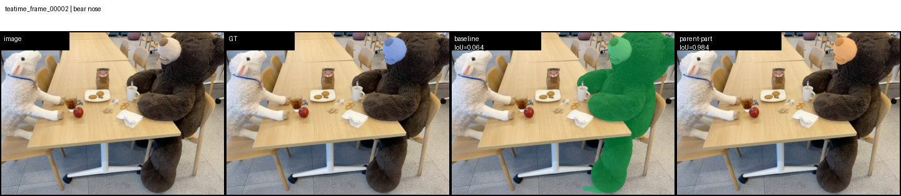
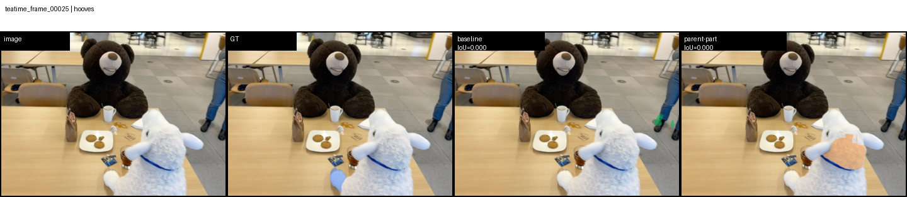
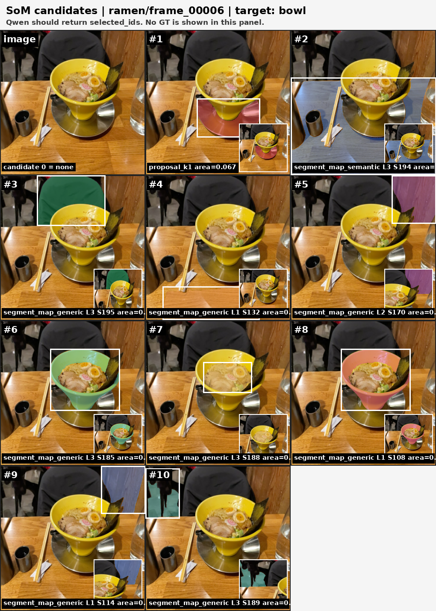
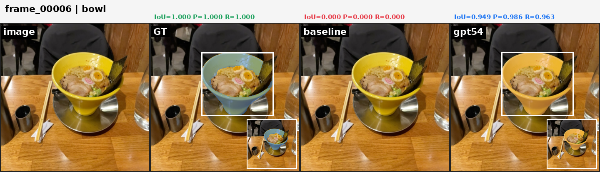
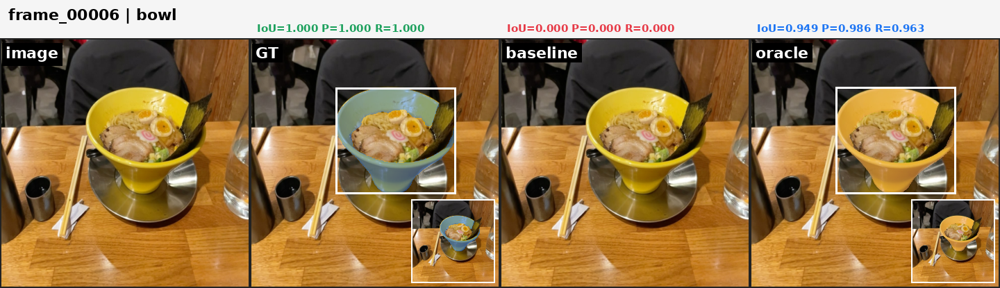
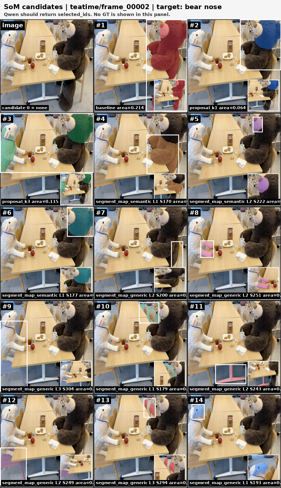
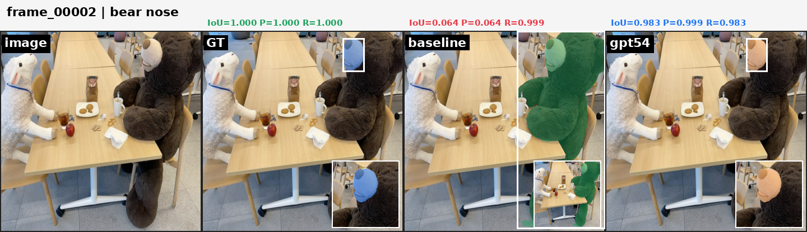
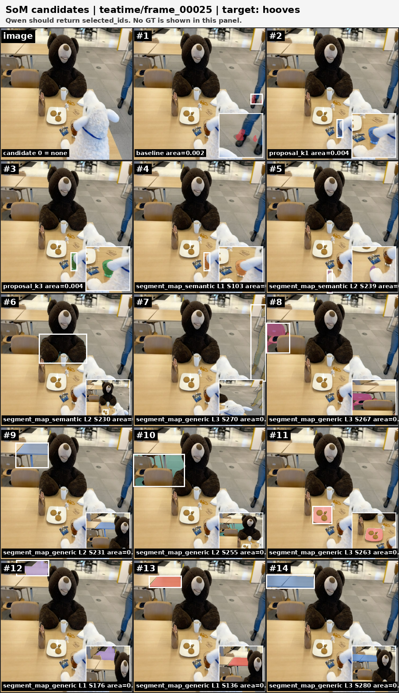
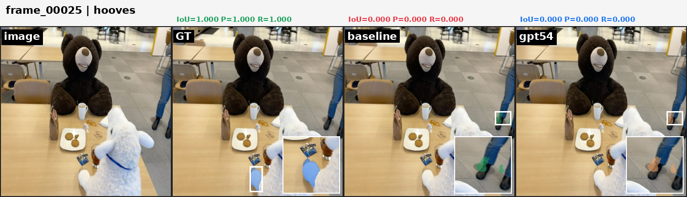

# THGS 层级语义改进与 GPT-SoM Rerouting 汇报总结

日期：2026-06-08  
项目：开放词汇 3D Gaussian Splatting 语义分割 / THGS  
远程实验服务器：4090 服务器  
远程 THGS 目录：

```text
/home/Groups/group2/Working/tyy/project/THGS-main
```

## 1. 交流与工作背景

本轮讨论围绕 THGS 在 LERF-OVS 四个场景上的开放词汇语义分割效果展开。前期已经尝试过层级语义继承、软查询路由、parent-part 语义约束、scene fill 等方案，但整体指标提升有限。

用户明确指出：

- `scene fill` 过于工程化，不适合作为主要方法。
- 需要分析 parent-part 语义目标是否真正达到。
- 当前指标只比 baseline 高一点，需要进一步分析大目标 object 类提升不明显的原因。
- 可以参考 ReLaGS 借助大模型提升 object segmentation 效果。
- 重点先在 `ramen` 的 object 低分样例上验证 LLM-SoM rerouting 是否有效。

因此，本轮工作的核心问题转为：

> THGS 的 object-level failure 是因为候选 mask 不存在，还是因为已有候选没有被正确路由/选择？

## 2. 初始问题分析

对 baseline 和已有改进结果分析后，发现：

- 当前非 fill 方法主要改善 part 类别。
- object 类别整体提升不明显。
- 在 `ramen` 场景中，低 IoU object 样例高度集中。

典型失败包括：

| 类型 | 示例 |
|---|---|
| 空 mask | `bowl`, `plate`, `sake cup` |
| 大面积误检 | `kamaboko`, `corn` |
| 细小目标选错 | `onion segments` |
| 候选存在但语义标签错误 | `bowl` 的正确 segment 被标成 `plastic ladle` |

关键发现：

> 许多正确 mask 已经存在于 fine segment map 中，但 CLIP 文本标签或原始语义路由没有把它选出来。

因此，问题更像是 **candidate rerouting / candidate selection 不足**，而不是单纯的候选缺失。

## 3. 完整复盘：从 THGS failure 到 parent-part 与 SoM 的证据链

本轮改动不是一次性提出一个最终方法，而是沿着 failure analysis 逐步推进。核心复盘如下：

| 阶段 | 观察到的问题 | 做法 | 证据 | 结论 |
|---|---|---|---|---|
| baseline 审查 | part query 容易扩成 parent object，object query 经常为空或选错 | 先做 parent-part / hierarchy routing | `bear nose` 可视化、`hooves` 失败可视化 | parent-part 对部分 part 有效，但不能解释 object 大幅低分 |
| parent-part 复盘 | parent anchor 对某些 part 有帮助，但小 part 候选不稳定 | 加入 anchor containment、面积先验、fine segment 后处理 | `bear nose` IoU `0.0642 -> 0.9840`，`hooves` 仍 `0.0000` | parent-part 是局部有效的 part 修正，不是总体 object 提升主因 |
| object failure 分析 | `bowl/plate/sake cup` 等 object baseline 为空，但 fine segment 中有正确候选 | 构建 SoM candidate panel | `ramen_bowl_frame_00006_som.png` 等候选图 | 很多 object failure 是候选选择失败，不是候选完全缺失 |
| GPT-SoM rerouting | 原始 CLIP label 会把正确候选误标成 `plastic ladle/spoon/egg` 等 | 用 GPT-5.4 在编号候选中做视觉选择 | `ramen_bowl/plate/sake cup` before-after 图 | VLM rerouting 能显著改善低分 object 样例 |
| oracle 上限 | 需要判断 GPT 还有多少选择错误，候选池本身还有多少上限 | 用 GT 选候选计算 oracle | oracle mIoU `0.7362`，GPT-SoM `0.6748` | GPT 已缩小 gap，但候选池和选择器仍有提升空间 |

### 3.1 为什么先做 parent-part

THGS 的细粒度开放词汇 prompt 中有一类典型问题：用户查询的是 part，但模型选出来的是 parent object。例如 `bear nose` 不是“熊”，而是熊鼻子；`hooves` 不是整只羊或玩偶，而是父物体上的局部蹄子。

因此 parent-part 的初始假设是：

> 如果能显式建立 parent anchor，再在 parent 内选择 part 候选，就能抑制 part mask 扩散成 object。

这个想法在 `bear nose` 上成立：



`bear nose` 的结果说明：

| 方法 | IoU | mask 面积 | 解释 |
|---|---:|---:|---|
| baseline | 0.0642 | 154099 | 几乎选成整只熊，说明 part 被 parent object 淹没 |
| parent-part | 0.9840 | 9761 | mask 收缩到鼻子局部，面积接近 GT `9906` |

但这个想法在 `hooves` 上失败：



`hooves` 的结果说明：

| 方法 | IoU | mask 面积 | 解释 |
|---|---:|---:|---|
| baseline | 0.0000 | 1727 | 没有选到正确蹄子 |
| parent-part | 0.0000 | 18302 | 仍未找到正确 part，反而选到白羊身体/头部大区域 |

所以 parent-part 的真实结论是：

> 它能解决“part 被 parent object 淹没”的一部分样例，但依赖两个前提：parent anchor 要正确，fine segment 中要有稳定的 part 候选。对 `hooves` 这类小、低显著性、候选不稳定的 part，parent-part 仍会失败。

### 3.2 为什么 parent-part 不能解释总体提升不高

进一步看 LERF 四场景，低分项不仅有 part，还有大量 object：

```text
bowl, plate, sake cup, kamaboko, corn, onion segments
```

这些不是 parent-part 问题。它们的失败更像是：

- baseline 输出空 mask；
- 或者选择了过大/错误区域；
- 或者正确候选存在，但自动 text label 错了；
- 例如 bowl 的正确候选可能被标成 `plastic ladle`。

因此如果继续只优化 parent-part，最多改善一小部分 part query，无法显著提升整体 mIoU。

### 3.3 为什么转向 SoM rerouting

SoM rerouting 的核心假设是：

> 既然 fine segment / proposal 中已经存在很多正确 mask，那么应该把问题转成“候选选择”而不是继续直接渲染一个单一 mask。

以 `ramen / bowl / frame_00006` 为例，SoM 候选图显示候选池中存在接近目标的 bowl mask：



GPT-5.4 before-after 图显示，rerouting 后能把 baseline 空/错 mask 改成更接近 GT 的 mask：



同类可视化还包括：

| 目标 | SoM 候选图 | GPT-5.4 对比图 | 说明 |
|---|---|---|---|
| `plate` | `visualizations/som_panels/ramen_plate_frame_00006_som.png` | `visualizations/gpt54_compare/ramen_plate_frame_00006.png` | 正确候选常被错误 text label 污染，需要视觉选择 |
| `sake cup` | `visualizations/som_panels/ramen_sake_cup_frame_00006_som.png` | `visualizations/gpt54_compare/ramen_sake_cup_frame_00006.png` | 小 object 原始路由容易漏检 |
| `kamaboko` | `visualizations/som_panels/ramen_kamaboko_frame_00006_som.png` | `visualizations/gpt54_compare/ramen_kamaboko_frame_00006.png` | 可抑制过大误检 |
| `corn` | `visualizations/som_panels/ramen_corn_frame_00024_som.png` | `visualizations/gpt54_compare/ramen_corn_frame_00024.png` | 黄色相似区域仍会造成混淆 |
| `onion segments` | `visualizations/som_panels/ramen_onion_segments_frame_00006_som.png` | `visualizations/gpt54_compare/ramen_onion_segments_frame_00006.png` | 碎片小目标仍较难 |

### 3.4 SoM 是否有效：指标证据

四场景总体指标：

| 方法 | Overall mIoU | mAcc | mP | mR | F1 |
|---|---:|---:|---:|---:|---:|
| baseline THGS | 0.5885 | 0.9776 | 0.6674 | 0.7141 | 0.6521 |
| GPT-5.4 SoM rerouting | 0.6748 | 0.9855 | 0.7662 | 0.7685 | 0.7449 |
| oracle 候选上限 | 0.7362 | 0.9882 | 0.8294 | 0.8289 | 0.8069 |

分场景 mIoU：

| Scene | baseline | GPT-5.4 SoM | oracle |
|---|---:|---:|---:|
| figurines | 0.5491 | 0.5982 | 0.6436 |
| ramen | 0.4209 | 0.6226 | 0.7778 |
| teatime | 0.8186 | 0.8325 | 0.8379 |
| waldo_kitchen | 0.5656 | 0.6460 | 0.6854 |

结论：

> GPT-SoM 的主要价值是验证：THGS 的许多 object-level failure 不是没有视觉候选，而是没有选对候选。它把总体 mIoU 从 `0.5885` 提升到 `0.6748`，但仍低于 oracle `0.7362`，说明候选选择器和候选池仍有改进空间。

### 3.5 失败边界：哪些地方还没有解决

本轮可视化也暴露了失败边界：

| 失败类型 | 例子 | 说明 |
|---|---|---|
| part 候选不稳定 | `hooves` | parent-part 和 SoM 都可能选不到正确小部件 |
| 小碎片目标困难 | `onion segments` | 候选碎、边界弱，即使 oracle 上限也不如大 object |
| 相似颜色/材质混淆 | `corn` | 黄色区域、egg、kamaboko 等互相干扰 |
| 闭源 VLM 不可作为核心方法 | GPT-5.4 SoM | 适合做 diagnostic / pseudo-label，不宜直接包装成完全可复现主方法 |

因此后续更合理的论文路线是：

1. 用 GPT-SoM 证明瓶颈在 candidate selection。
2. 用 GPT-SoM 结果蒸馏一个可复现的 lightweight reranker。
3. parent-part 作为细粒度 part 约束模块保留，但要如实报告成功和失败边界。

## 4. Parent-part 语义继承与细粒度 part 修正

在转向 SoM rerouting 之前，先审查了本地已有的“THGS 层级语义继承与软查询路由改进方案”。这条线的目标不是直接提升所有 object mask，而是解决细粒度 part prompt 在 THGS 中容易被父物体淹没的问题。

### 3.1 原始 parent-part 目标

parent-part 设计目标可以概括为：

> 对 `bear nose`, `hooves`, `hand`, `hat` 等 part 查询，不再只按文本相似度在全场景中选 Gaussian，而是先找到父物体或锚点区域，再在该区域内部选择更小、更语义匹配的 part segment。

具体希望达到三点：

1. **继承父物体语义上下文**：例如 `bear nose` 应该优先在 `stuffed bear` 区域附近寻找，而不是在整张图中寻找任意 “nose-like” 或小区域。
2. **抑制 part 扩散成 object**：例如 `hooves` 不能直接选中整只羊或整只玩偶，而应该只覆盖父物体中的局部区域。
3. **提升细粒度 part 稳定性**：同一个 part 在相邻层级 segment 中可能有多个候选，需要利用 containment、面积先验和跨层一致性做选择。

### 3.2 效果不佳的原因

审查发现，早期 parent-part 改动整体提升有限，主要有以下原因：

| 问题 | 影响 |
|---|---|
| 只靠文本相似度选 part | CLIP 容易把父物体整体或相邻部件打高分，part mask 过大 |
| parent 约束不够硬 | `bear nose` 等查询仍可能漂移到父物体外部的相似区域 |
| 面积先验缺失 | 小 part 和大 object 在得分上没有足够区分 |
| 候选层级不稳定 | 不同 NAG/segment level 中同一 part 的边界质量不同 |
| 对 object 类帮助有限 | parent-part 针对 part，不解决 `bowl`, `plate`, `sake cup` 这类 object 选错候选的问题 |

因此，parent-part 的目的只“部分达到”：它能让若干 part 查询更符合父物体局部约束，但不能解释或解决四场景中 object-level mIoU 提升不高的问题。

### 3.3 Parent 和 part 在代码中的链接方式

本项目中 parent-part 不是只在文字上描述“父物体-部件关系”，而是在代码中显式落到三个对象：

| 代码对象 | 含义 | 例子 |
|---|---|---|
| `role` | 当前 prompt 的类型 | `object`, `part`, `modifier` |
| `anchor_terms` | parent/base object，用来生成空间锚点 | `bear nose` 的 anchor 是 `bear` 或候选中的 bear 相关 label |
| `part_terms` | part noun 或局部语义，用来重排细粒度候选 | `bear nose` 的 part terms 是 `nose`, `bear nose` |

入口在：

```text
remote_thgs_patch/query_reasoner.py
```

`heuristic_query_plan()` 会先解析 prompt：

```text
query = "bear nose"
tail = "nose"
tail in PART_HEADS -> role = "part"
parent = "bear"
target_terms = ["bear nose", "nose", "nose of bear", "bear's nose"]
anchor_terms = ["bear"]
part_terms = ["nose", "bear nose"]
```

如果 prompt 是 `object with modifier` 结构，例如 `figurine with red hat`，则会被解析为：

```text
role = "modifier"
anchor_terms = [base object]
part_terms = [modifier phrase, modifier head]
contrast_terms = [same base object but different modifier]
```

所以 parent-part 链接的第一步是：**把自然语言 prompt 拆成 parent/base anchor 和 part/local term**。

### 3.4 层级语义继承如何实现

层级语义继承在：

```text
remote_thgs_patch/nag_data.py
```

`SemanticNAG` 会根据多层 superpoint label 建立 child-parent 映射：

```text
build_parent_child_maps(labels)
child_to_parent[level][child_superpoint_id] = parent_superpoint_id
```

也就是说，每个低层细粒度 superpoint 都知道自己属于哪个高层 parent superpoint。随后 `get_hierarchy_features()` 对低层 feature 加入 parent 上下文：

```text
enhanced_child =
    child_feat
    + parent_weight * gate * parent_feat
    + residual_weight * (child_feat - parent_feat)
```

其中：

- `parent_feat` 提供父物体语义上下文。
- `residual = child_feat - parent_feat` 保留部件局部差异。
- `gate` 由 child-parent cosine similarity 控制，避免强行把无关 parent 信息注入 child。

这一步解决的是特征层面的链接：**part superpoint 既保留自己的局部语义，也继承 parent object 的上下文**。

### 3.5 推理时如何从 parent 约束 part

主推理入口在：

```text
remote_thgs_patch/test_lerf.py
```

当启用 `--refine_parts` 且 `plan.role == "part"` 时，代码进入 part 专用分支：

1. 用 `target_terms` 计算主语义相似度：

```text
primary_sim = similarity_for_terms(vlm, snag.feat, target_terms)
```

例如 `bear nose` 会同时使用 `bear nose`, `nose`, `nose of bear`, `bear's nose`。

2. 用 `part_terms` 计算局部 part 相似度：

```text
aux_sim = similarity_for_terms(vlm, snag.feat, part_terms)
```

例如 `nose`, `bear nose`。这一步让候选更偏向局部部件，而不是整个 parent。

3. 组合主语义和 part 语义得到候选：

```text
score = primary_val + part_aux_weight * aux_val
```

对应函数：

```text
reranked_candidates(primary_sim, aux_sim, part_levels, part_candidate_topk, part_aux_weight)
```

4. 用 `anchor_terms` 渲染 parent anchor mask：

```text
anchor_mask = plan_anchor_mask(..., plan.anchor_terms, ...)
```

例如先渲染 `bear` 或 `stuffed bear` 的区域，作为 nose 必须落入的空间范围。

5. 用 parent anchor 过滤 part 候选：

```text
containment = area(candidate_mask ∩ anchor_mask) / area(candidate_mask)
```

如果 containment 小于 `part_anchor_min_containment`，该候选会被丢弃。保留下来的候选按下式重排：

```text
final_score =
    candidate_score
    + part_anchor_weight * containment
    - part_area_penalty * area_ratio
```

对应函数：

```text
anchor_filtered_related_gaussian(...)
```

这一步是最关键的 parent-part 链接：**part 候选必须在 parent anchor 内部或高度重合，同时面积不能过大**。

6. 最终把选中的 superpoint 转成 Gaussian mask：

```text
gaussian_from_candidates(snag, selected)
```

然后通过 THGS 原本的 Gaussian render 流程输出 2D mask。

### 3.6 Fine segment 后处理中的 parent-part 链接

除了 Gaussian 推理分支，还保留了一个更可解释的 fine segment 后处理：

```text
remote_thgs_patch/parent_part_proposal_render.py
```

它的逻辑是：

1. `anchor_candidates(prompt, labels)` 根据 `heuristic_query_plan()` 找 parent/base label。
2. `load_anchor()` 从 baseline 输出中读取 parent mask，并做轻微 dilation。
3. 遍历 fine segment map 中所有 segment。
4. 对每个 segment 计算：

```text
containment = area(segment ∩ anchor_mask) / area(segment)
cover = area(segment ∩ anchor_mask) / area(anchor_mask)
```

5. 如果 segment 不在 parent anchor 内，直接过滤：

```text
containment < min_containment -> reject
```

6. 对保留 segment 打分：

```text
score =
    containment_weight * containment
    - cover_penalty * abs(log(cover / target_cover))
    - level_penalty
    + semantic_bonus
    - same_label_area_penalty
    + consistency_bonus
```

其中：

- `semantic_bonus` 来自 segment 的 `text_label` 是否等于 `part_terms` 或 head noun。
- `target_cover` 控制 part 占 parent 的合理比例，例如 `hooves` 更小，`nose` 稍大。
- `same_label_area_penalty` 防止 text label 正确但区域过大，避免把 parent 整体选成 part。
- `consistency_bonus` 奖励跨层级重复出现、边界较稳定的 segment。

最后：

```text
out &= anchor_mask
```

保证输出 part mask 被裁剪在 parent anchor 范围内。

### 3.7 一个具体例子：`bear nose`

以 `teatime / bear nose` 为例，代码中的链路是：

```text
prompt: bear nose
  -> QueryReasoner
  -> role = part
  -> anchor_terms = [bear]
  -> part_terms = [nose, bear nose]
```

然后：

```text
anchor_terms [bear]
  -> 通过 CLIP/NAG 找 bear superpoint
  -> 渲染成 anchor_mask
```

同时：

```text
part_terms [nose, bear nose]
  -> 在 fine levels 上找 nose-like superpoints/segments
  -> 候选必须满足 containment(candidate, bear_anchor) 足够高
  -> 候选面积接近 nose 对 parent 的合理比例
  -> 输出局部 nose mask
```

所以 parent 和 part 的关系不是通过 hard-coded 类别表直接连起来，而是通过：

1. prompt 解析得到 `anchor_terms` 和 `part_terms`；
2. NAG 层级图提供 child-parent superpoint 映射；
3. parent anchor mask 提供空间约束；
4. part similarity 和面积先验提供局部选择；
5. containment 打分把二者绑定到最终 mask。

### 3.8 本轮保留和调整的 parent-part 实现

本轮没有继续使用 `scene fill` 作为主要方法，而是保留了更可解释的 parent-part 后处理与诊断脚本：

```text
remote_thgs_patch/test_lerf.py
remote_thgs_patch/query_reasoner.py
remote_thgs_patch/nag_data.py
remote_thgs_patch/parent_part_proposal_render.py
remote_thgs_patch/diagnose_parent_part_candidates.py
```

其中关键调整包括：

| 调整 | 作用 |
|---|---|
| `QueryReasoner` 将 prompt 分成 object / part / modifier 角色 | 避免所有 prompt 使用同一种路由策略 |
| `hier_soft` 层级语义特征 | 在 Gaussian 语义特征中加入 parent feature 与 residual feature |
| `refine_parts` 分支 | 只对 part 查询启用更细粒度候选重排 |
| `plan_anchor_mask` / anchor terms | 用父物体或上下文物体生成空间锚点 |
| `anchor_filtered_related_gaussian` | 候选必须与 parent anchor 有足够 containment |
| `part_area_penalty` / `target_cover` | 防止 part mask 扩张成整物体 |
| `part_diversity_iou` | 避免 top-k 候选高度重复 |
| `parent_part_proposal_render.py` | 从 fine segment map 中按 containment、cover、语义 bonus、跨层一致性选择 part mask |
| `diagnose_parent_part_candidates.py` | 输出候选排序和 GT IoU，用于判断失败是候选缺失还是排序错误 |

这部分更适合作为论文或汇报中的 **细粒度 part 修正模块 / failure analysis 工具**，而不是作为解决 object-level failure 的主方法。

### 3.9 Parent-part 与 SoM rerouting 的分工

后续引入 GPT-SoM rerouting，并不是否定 parent-part，而是因为二者解决的问题不同：

| 模块 | 主要解决对象 | 主要瓶颈 | 本轮结论 |
|---|---|---|---|
| parent-part 语义继承 | `bear nose`, `hooves`, `hand` 等 part prompt | part 容易被父物体或相邻区域淹没 | 对 part 查询有解释性和局部收益，但难以显著提升整体 object mIoU |
| GPT-SoM rerouting | `bowl`, `plate`, `sake cup`, `kamaboko`, `corn`, `onion segments` 等 object/thing prompt | 正确候选存在但语义路由选错 | 对 object 低分样例提升明显，是本轮总体指标提升的主要来源 |

因此，汇报时建议这样表述：

> Parent-part 改进验证了层级语义和空间锚点对细粒度 part 查询是必要的，但整体提升不高说明 THGS 的主要 object failure 不是 parent-part 关系缺失，而是候选选择和语义路由不足。基于这个判断，后续转向 ReLaGS-inspired SoM rerouting，用 VLM 在候选 mask 中做显式选择。

### 3.10 Parent-part 可视化证据：成功与失败案例

为了单独判断 parent-part 是否有效，这里只使用 `render_parent_part/lerf` 的真实输出，不混用 GPT-SoM 结果。

#### 成功案例：`teatime/frame_00002/bear nose`

这个样例中，baseline 把 `bear nose` 误扩展成了几乎整只熊，说明原始 THGS 只靠文本相似度时容易把 part query 扩散为 parent object。parent-part 后处理先用 parent anchor 限定熊的区域，再在该区域内按 part 面积和局部语义选择候选，最终 mask 收缩到鼻子局部。

| 指标 | baseline | parent-part |
|---|---:|---:|
| IoU | 0.0642 | 0.9840 |
| mask 面积 | 154099 | 9761 |
| GT 面积 | 9906 | 9906 |


这张图从左到右是：

```text
原图 -> GT -> baseline -> parent-part
```

可以看到 baseline 的绿色区域覆盖了整只熊，而 parent-part 的橙色区域基本贴合鼻子 GT。这个案例说明：当 parent anchor 正确、fine segment 中存在合适局部候选时，parent-part 能有效抑制 part 扩散成 object。

#### 失败案例：`teatime/frame_00025/hooves`

这个样例中，`hooves` 是更小、更低显著性的 part。baseline 没有选到正确蹄子，parent-part 后处理也没有改善，反而选到了白羊身体/头部的一大片区域。

| 指标 | baseline | parent-part |
|---|---:|---:|
| IoU | 0.0000 | 0.0000 |
| mask 面积 | 1727 | 18302 |
| GT 面积 | 4678 | 4678 |


这个失败案例说明：parent-part 的关键前提是候选池里必须存在合理的局部 part segment。如果 fine segment 没有稳定给出蹄子候选，或者 anchor/面积先验把候选推向更显著的身体区域，parent-part 仍然会失败。

因此，对 parent-part 的结论应写得谨慎：

> Parent-part 对 `bear nose` 这类 parent 明确、局部候选存在的 part query 有明显效果；但对 `hooves` 这类小、低显著性、候选不稳定的 part query 效果不稳。它是一个有效的细粒度 part 约束机制，但不是解决所有 object/part failure 的通用模块。

## 5. 方法调整思路

本轮没有继续依赖 scene fill，而是设计了一个 ReLaGS-inspired 的 SoM 候选选择实验。

准确表述应为：

> ReLaGS-inspired SoM-based VLM rerouting

而不是完整 ReLaGS。

原因：

- 采用了 ReLaGS 中类似的 Set-of-Mark 编号候选 + VLM 选择思想。
- 但没有构建完整 3D scene graph。
- 没有做 superpoint-level lifting。
- 在 THGS 中它是一个 post-hoc rerouting / diagnostic module。

整体流程：

1. 找出 baseline IoU `< 0.1` 的低分 prompt-frame 样例。
2. 为每个低分样例生成候选 mask。
3. 将候选 mask 画成编号 SoM 面板。
4. 使用 VLM 从编号候选中选择最符合目标语义的 mask。
5. 用选中的 mask 替换 baseline 输出。
6. 与 baseline 和 oracle candidate 上限对比。

## 6. 代码改动

新增主要脚本：

```text
remote_thgs_patch/llm_som_object_reroute.py
```

同时保留并整理了 parent-part 相关 patch：

```text
remote_thgs_patch/test_lerf.py
remote_thgs_patch/parent_part_proposal_render.py
remote_thgs_patch/diagnose_parent_part_candidates.py
remote_thgs_patch/merge_scene_fill_soft_roles.py
```

其中 `merge_scene_fill_soft_roles.py` 仅作为旧实验记录保留，不建议作为当前主方案使用。

远程同步位置：

```text
/home/Groups/group2/Working/tyy/project/THGS-main/llm_som_object_reroute.py
```

脚本支持以下功能：

| 命令 | 功能 |
|---|---|
| `build` | 构建候选、生成 SoM 编号图、保存候选分析 |
| `qwen` | 使用本地 Qwen3-VL-8B-Instruct 做候选选择 |
| `apply` | 将选择结果应用到 baseline prediction tree |
| `report` | 输出 per-target 汇总报告 |

后续新增：

- `--all_prompts`：允许对场景中所有 prompt 自动构建 SoM，而不是只限制 ramen 六个 object。
- `gpt54` apply/report 模式：用于应用 GPT-5.4 API 的选择结果。

本地 Git 提交记录：

```text
b08f319 Add LLM SoM ramen rerouting experiment
946fdff Support GPT SoM selection apply mode
dbb7207 Allow SoM build over all prompts
```

说明：GitHub push 曾失败，原因是本机 GitHub SSH publickey 权限不通过。

## 7. 候选池构建修正

最初候选主要来自：

- baseline prediction
- proposal clip outputs
- scene_opt 诊断源
- fine segment map 中与目标文本相似的 segment

但发现一个问题：

> 正确 mask 经常被 CLIP/text label 误标成其他类别，因此如果只用文本标签筛选，会漏掉真正正确的视觉候选。

例如：

| target | 正确 segment 的错误标签 |
|---|---|
| `bowl` | `plastic ladle` |
| `corn` | `egg`, `yellow pouf` |
| `plate` | `plastic ladle`, `spoon` |

因此加入了：

```text
segment_map_generic
```

即基于目标面积先验的通用 segment 候选，不再完全相信自动文本标签。

该改动显著提高候选池 oracle 上限。

以 `ramen` 低分样例为例：

| target | baseline IoU | 修正后 oracle IoU |
|---|---:|---:|
| bowl | 0.0000 | 0.9653 |
| corn | 0.0735 | 0.6147 |
| kamaboko | 0.0573 | 0.9096 |
| onion segments | 0.0000 | 0.5663 |
| plate | 0.0000 | 0.8699 |
| sake cup | 0.0284 | 0.9102 |

这说明候选池本身是有潜力的，主要瓶颈是选候选。

## 8. 本地 Qwen3-VL 实验

服务器中找到的模型：

```text
/home/Groups/group2/.cache/modelscope/hub/models/Qwen/Qwen3-VL-8B-Instruct
```

该模型实际是 `Qwen3-VL-8B-Instruct`，不是纯文本 Qwen3-8B。

环境问题：

- `thgs` 环境有 transformers，但 PyTorch 版本过低。
- 最终使用 `esam3_312` 环境的 torch/torchvision，并通过脚本兼容加载 transformers。

本地 Qwen3-VL 在 `ramen` 31 个低分样例上的结果：

| 方法 | 低分样例 IoU | ramen 全场 mIoU |
|---|---:|---:|
| baseline | 0.0294 | 0.4209 |
| Qwen3-VL SoM | 0.1721 | 0.4856 |
| oracle | 0.7849 | 0.7596 |

结论：

> 本地 Qwen3-VL 能带来一定提升，但选择不稳定，经常偏向大 mask 或第一个候选。

## 9. GPT-5.4 API 实验

用户提供 OpenAI 兼容 API 后，先验证模型列表，确认可用模型包括：

```text
gpt-5.4
gpt-5.4-mini
gpt-5.5
```

API key 没有写入仓库、脚本或文档，只以一次性环境变量使用。

由于需要上传 SoM 面板图片到外部 API，已在用户明确同意后继续实验。

先在 `ramen` 31 个低分样例上测试 GPT-5.4：

| 方法 | 低分样例 IoU | ramen 全场 mIoU |
|---|---:|---:|
| baseline | 0.0294 | 0.4209 |
| Qwen3-VL SoM | 0.1721 | 0.4856 |
| GPT-5.4 SoM | 0.5679 | 0.6633 |
| oracle | 0.7849 | 0.7596 |

GPT-5.4 明显优于本地 Qwen3-VL。

## 10. 四场景扩展实验

扩展到 LERF-OVS 四个场景：

```text
figurines
ramen
teatime
waldo_kitchen
```

处理对象：

> 所有 baseline IoU `< 0.1` 的 prompt-frame 样例。

低分样例统计：

| Scene | 低分样例数 |
|---|---:|
| figurines | 11 |
| ramen | 33 |
| teatime | 4 |
| waldo_kitchen | 6 |
| total | 54 |

四场景总体结果：

| 方法 | Overall mIoU | mAcc | mP | mR | F1 |
|---|---:|---:|---:|---:|---:|
| baseline THGS | 0.5885 | 0.9776 | 0.6674 | 0.7141 | 0.6521 |
| GPT-5.4 SoM rerouting | 0.6748 | 0.9855 | 0.7662 | 0.7685 | 0.7449 |
| oracle 候选上限 | 0.7362 | 0.9882 | 0.8294 | 0.8289 | 0.8069 |

分场景 mIoU：

| Scene | baseline | GPT-5.4 SoM | oracle |
|---|---:|---:|---:|
| figurines | 0.5491 | 0.5982 | 0.6436 |
| ramen | 0.4209 | 0.6226 | 0.7778 |
| teatime | 0.8186 | 0.8325 | 0.8379 |
| waldo_kitchen | 0.5656 | 0.6460 | 0.6854 |

结论：

> GPT-5.4 SoM rerouting 将四场景总体 mIoU 从 0.5885 提升到 0.6748，提升 +0.0863。oracle 上限为 0.7362，说明候选池仍有进一步利用空间。

## 11. 可视化结果、对比解释与保存路径

本节建议作为给老师汇报时的重点页。每个可视化样例都按同一逻辑解释：

```text
baseline 失败现象
-> 为什么原 THGS 路由容易失败
-> 本轮改动如何介入
-> 可视化中应该看什么
-> 指标或 oracle 上限说明是否有效
```

### 11.1 四场景 SoM 编号候选图：证明“正确候选是否存在”

根目录：

```text
/home/Groups/group2/Working/tyy/project/THGS-main/output/gpt54_som_low_all_artifacts/
```

每个场景下：

```text
/home/Groups/group2/Working/tyy/project/THGS-main/output/gpt54_som_low_all_artifacts/<scene>/som_panels/
```

示例：

```text
/home/Groups/group2/Working/tyy/project/THGS-main/output/gpt54_som_low_all_artifacts/ramen/som_panels/ramen/frame_00006/bowl_som.png
```

该图展示：

- 原图
- 编号候选 mask
- 每个候选的 overlay
- 候选来源和面积

本地 GitHub 复现包建议保存代表性图到：

```text
visualizations/som_panels/
```

汇报中建议至少展示以下六个 `ramen` object 低分样例：

| 样例 | baseline 问题 | 看 SoM 图时要说明什么 | 结论 |
|---|---|---|---|
| `bowl` | baseline 为空 mask | SoM 候选中存在完整 bowl，但文本路由把它误标到其他类别 | 候选存在，失败来自候选选择 |
| `plate` | baseline 为空或选到局部 | plate 候选常被 `plastic ladle/spoon` 等标签污染 | 不能只按自动 text label 筛候选 |
| `sake cup` | 小 object 漏检 | SoM 候选有小杯子，但原路由置信度低 | VLM 视觉选择比 CLIP label 更稳 |
| `kamaboko` | 大面积误检 | 候选中有更贴合的局部鱼糕区域 | rerouting 能抑制过大 mask |
| `corn` | 易选到黄色相似区域 | 候选中存在 corn-like 区域，但与 egg/yellow region 混淆 | 仍依赖候选质量和 VLM 判别 |
| `onion segments` | 细小目标选错 | 候选很碎，oracle 也低于大物体 | 小碎片仍是后续难点 |

图片引用模板：

```markdown

```

已保存到 GitHub 的代表性 SoM 图：

| 目标 | 本地可视化文件 | 作用 |
|---|---|---|
| `bowl` | `visualizations/som_panels/ramen_bowl_frame_00006_som.png` | 展示正确 bowl 候选存在 |
| `plate` | `visualizations/som_panels/ramen_plate_frame_00006_som.png` | 展示 plate 候选被文本标签污染时仍可视觉选择 |
| `sake cup` | `visualizations/som_panels/ramen_sake_cup_frame_00006_som.png` | 展示小 object 候选 |
| `kamaboko` | `visualizations/som_panels/ramen_kamaboko_frame_00006_som.png` | 展示局部鱼糕候选与过大候选的差异 |
| `corn` | `visualizations/som_panels/ramen_corn_frame_00024_som.png` | 展示黄色相似区域混淆 |
| `onion segments` | `visualizations/som_panels/ramen_onion_segments_frame_00006_som.png` | 展示碎片状小目标候选 |


### 11.2 GPT-5.4 before/after 对比图：证明“改后是否有效”

根目录：

```text
/home/Groups/group2/Working/tyy/project/THGS-main/output/gpt54_som_low_all_artifacts/<scene>/applied_compare/gpt54/
```

示例：

```text
/home/Groups/group2/Working/tyy/project/THGS-main/output/gpt54_som_low_all_artifacts/ramen/applied_compare/gpt54/ramen/frame_00006/bowl.png
```

对比图包含：

- 原图
- GT
- baseline mask
- GPT-5.4 rerouting 后的 mask

本地 GitHub 复现包建议保存代表性图到：

```text
visualizations/gpt54_compare/
```

汇报时不要只说“mIoU 提升”，需要逐图说明：

| 对比项 | 应该观察的视觉差异 | 说明 |
|---|---|---|
| 原图 vs GT | 目标真实位置和大小 | 明确目标不是语义歧义 |
| baseline vs GT | 原 THGS 是空、过大还是错选 | 定性失败类型 |
| GPT-5.4 rerouting vs GT | rerouting 是否选中更接近 GT 的候选 | 证明 VLM 选择有效 |
| GPT-5.4 vs oracle | 还差在哪里 | 判断后续该改 VLM 选择还是候选池 |

图片引用模板：

```markdown

```

已保存到 GitHub 的 GPT-5.4 before/after 对比图：

| 目标 | 本地可视化文件 | 汇报时说明 |
|---|---|---|
| `bowl` | `visualizations/gpt54_compare/ramen_bowl_frame_00006.png` | baseline 为空，GPT-SoM 选中 bowl 候选 |
| `plate` | `visualizations/gpt54_compare/ramen_plate_frame_00006.png` | 从错误或空预测转为更贴近 plate 的候选 |
| `sake cup` | `visualizations/gpt54_compare/ramen_sake_cup_frame_00006.png` | 小 object 漏检被部分修正 |
| `kamaboko` | `visualizations/gpt54_compare/ramen_kamaboko_frame_00006.png` | 抑制过大误检，选择更局部候选 |
| `corn` | `visualizations/gpt54_compare/ramen_corn_frame_00024.png` | 展示 GPT 对黄色细粒度目标的选择效果和残余混淆 |
| `onion segments` | `visualizations/gpt54_compare/ramen_onion_segments_frame_00006.png` | 展示碎片目标仍是困难样例 |


### 11.3 oracle 上限对比图：证明“候选池上限”

```text
/home/Groups/group2/Working/tyy/project/THGS-main/output/gpt54_som_low_all_artifacts/<scene>/applied_compare/oracle/
```

oracle 图不是最终方法结果，而是诊断候选池的 upper bound。解释时要强调：

- 如果 oracle 高、GPT 低：候选存在，VLM 选择还不够稳。
- 如果 oracle 也低：候选池本身缺目标或边界质量差。
- 本轮四场景 oracle mIoU `0.7362`，GPT-5.4 mIoU `0.6748`，说明大部分提升空间来自 candidate selection，但候选池仍可继续优化。

本地 GitHub 复现包建议保存代表性图到：

```text
visualizations/oracle_compare/
```

已保存代表性 oracle 图：

```text
visualizations/oracle_compare/ramen_bowl_frame_00006_oracle.png
```



### 11.4 SoM part-query 诊断：不要和 parent-part 混淆

这里必须分清楚：下面这些 `teatime / bear nose` 和 `teatime / hooves` 图属于 **SoM rerouting 对 part query 的诊断案例**，不是 parent-part 后处理结果。它们只能说明 VLM 在编号候选中选择 part mask 的能力，不能直接证明 parent-part 语义继承模块有效。

已保存到 GitHub 的 SoM part-query 图：

| 样例 | 本地可视化文件 | 结论 |
|---|---|---|
| `bear nose` SoM | `visualizations/som_part_cases/teatime_bear_nose_frame_00002_som.png` | 候选池中存在局部 nose 候选 |
| `bear nose` GPT-SoM 对比 | `visualizations/som_part_cases/teatime_bear_nose_frame_00002_gpt54.png` | baseline 选成整熊，GPT-SoM 选到局部 nose，IoU 从 `0.064` 到 `0.983`，这是 SoM 成功案例 |
| `hooves` SoM | `visualizations/som_part_cases/teatime_hooves_frame_00025_som.png` | 候选中明显混入人的腿、桌椅、盘子等干扰，正确 hooves 候选不明显 |
| `hooves` GPT-SoM 对比 | `visualizations/som_part_cases/teatime_hooves_frame_00025_gpt54.png` | GPT-SoM 仍选错到人腿/鞋附近，IoU 仍为 `0.000`，这是 SoM 失败案例 |









这两个 part-query 例子说明：

- `bear nose`：当候选池里有明显正确的局部候选时，SoM + GPT-5.4 能把原本选成整物体的 mask 纠正成局部 part。
- `hooves`：当候选池没有稳定给出正确局部 part，或者候选里有更显眼的相似小区域时，SoM 仍会失败。
- 因此，SoM 的有效性依赖两个条件：候选池覆盖正确目标、VLM 能从编号候选中稳定识别目标。

### 11.5 Parent-part 可视化：需要单独看 `render_parent_part`

parent-part 必须单独评价，不能用上面的 GPT-SoM 图来证明。它对应的真实输出路径是：

```text
/home/Groups/group2/Working/tyy/project/THGS-main/output/render_parent_part/lerf
/home/Groups/group2/Working/tyy/project/THGS-main/output/parent_part_debug.json
```

本地 GitHub 复现包中应保存到：

```text
visualizations/parent_part/
```

本轮已补充两个真实 `render_parent_part` 案例，一个成功、一个失败：

| 类型 | 样例 | baseline IoU | parent-part IoU | 观察结论 |
|---|---|---:|---:|---|
| 成功 | `teatime/frame_00002/bear nose` | 0.0642 | 0.9840 | baseline 几乎选成整只熊，parent-part 通过 parent anchor 和面积约束把 mask 收缩到鼻子局部 |
| 失败 | `teatime/frame_00025/hooves` | 0.0000 | 0.0000 | parent-part 没有找到正确蹄子，反而选到白羊身体/头部大片区域，说明 anchor/候选或面积先验在该 part 上失效 |

对应本地可视化：

```text
visualizations/parent_part/teatime_frame_00002_bear_nose_parent_part_compare.png
visualizations/parent_part/teatime_frame_00025_hooves_parent_part_compare.png
```


这两张图展示的是 parent-part 本身，不是 SoM：

- `bear nose` 成功的原因：baseline 原本把整只熊作为高相似区域，parent-part 使用 `anchor_terms=[bear]` 确定父物体，再在父物体内部按 part 面积和局部语义选择更小 segment，因此 mask 从整熊收缩为鼻子局部。
- `hooves` 失败的原因：`hooves` 是更小、更低显著性的 part，正确候选不稳定；parent anchor 约束虽然阻止了完全无关区域，但候选选择仍落到白羊大区域，面积先验没有把它压到真正蹄子位置。
- 因此 parent-part 的有效性不是“整体稳定提升”，而是“在 parent anchor 正确且 fine segment 中存在合适 part 候选时有效；在候选缺失或 anchor/面积先验不适配时失败”。

parent-part 的成功/失败判据如下：

| 判据 | 成功表现 | 失败表现 |
|---|---|---|
| parent anchor 是否正确 | anchor 覆盖目标 part 所属父物体 | anchor 本身选错父物体或为空 |
| containment 是否生效 | part candidate 大部分落在 parent 内 | candidate 落到 parent 外的相似区域 |
| 面积先验是否合理 | part 只覆盖父物体局部 | part 扩张成整物体或过小为空 |
| fine segment 是否有正确候选 | `parent_part_debug.json` 中 top candidate 与 GT 接近 | top candidate text/area/containment 分数高但 GT IoU 低 |

解释 parent-part 图时要结合 `parent_part_debug.json` 中的字段：

| debug 字段 | 含义 | 汇报时怎么解释 |
|---|---|---|
| `anchors` | 当前 part 使用了哪些 parent/base mask | 说明 parent 来源 |
| `containment` | part candidate 有多少比例落在 parent 内 | 证明空间约束是否生效 |
| `cover` | part 占 parent 的比例 | 判断是否选成整物体 |
| `text_label` | segment 自动语义标签 | 判断 text label 是否可靠 |
| `score` | 综合 containment、面积、语义 bonus 后的分数 | 说明为什么选这个候选 |

当前结论应谨慎表述为：

> Parent-part 模块在机制上提供了可解释的 parent anchor、containment 和面积先验，但需要用 `render_parent_part` 的真实 before/after 图以及 `parent_part_debug.json` 才能证明具体样例是否有效。不能用 GPT-SoM 的 part-query 图替代 parent-part 证据。

### 11.6 最终预测输出

GPT-5.4 rerouting 后预测：

```text
/home/Groups/group2/Working/tyy/project/THGS-main/output/render_gpt54_som_low_all/lerf
```

oracle 上限预测：

```text
/home/Groups/group2/Working/tyy/project/THGS-main/output/render_gpt54_som_low_all_oracle/lerf
```

### 11.7 Parent-part 诊断结果

parent-part 候选诊断脚本：

```text
/home/Groups/group2/Working/tyy/project/THGS-main/diagnose_parent_part_candidates.py
```

parent-part 后处理输出：

```text
/home/Groups/group2/Working/tyy/project/THGS-main/output/render_parent_part/lerf
```

debug JSON：

```text
/home/Groups/group2/Working/tyy/project/THGS-main/output/parent_part_debug.json
```

该 JSON 记录每个 part prompt 使用的 anchors、被选中的 segment layer / segment_id、面积、containment、cover、text label 和最终 score，便于后续复盘 `bear nose`、`hooves` 等 part 查询是否真正受 parent 约束。

## 12. 适合写进论文的表述

不建议直接写成：

> We use ReLaGS.

更准确的写法：

> ReLaGS-inspired SoM-based VLM rerouting.

或：

> Inspired by the Set-of-Mark annotation strategy in ReLaGS, we construct numbered candidate masks and query a VLM to reroute low-confidence open-vocabulary predictions.

建议论文中定位为：

1. failure analysis
2. diagnostic experiment
3. optional VLM-assisted rerouting module
4. upper-bound study for candidate selection

核心论点：

> THGS 的大目标 object failure 很多不是因为没有视觉候选，而是因为语义路由没有从候选中选出正确 mask。GPT-5.4 SoM rerouting 显著缩小了 baseline 与 oracle candidate 上限之间的差距。

## 13. 后续建议

当前 GPT-5.4 API 结果很强，但作为论文主方法仍有风险：

- 闭源模型不可完全复现。
- API 成本和稳定性可能被审稿人质疑。
- 依赖外部模型，不一定适合做核心 contribution。

更稳妥的后续方向：

1. 使用 GPT-5.4 结果作为 pseudo-label，训练一个 lightweight reranker。
2. 将 SoM rerouting 蒸馏到开源 VLM 或 CLIP-based reranker。
3. 只在论文中把 GPT-5.4 作为 diagnostic / upper-bound evidence。
4. 进一步改进候选池，缩小 GPT 与 oracle 的差距。
5. 对失败类如 `corn`, `onion segments`, `figurines` 中的小物体做更细粒度候选生成。

## 14. 汇报用一句话总结

本轮实验表明，parent-part 语义继承和空间锚点能改善部分细粒度 part 查询，但它不是 object-level 指标提升有限的主要原因。THGS 在 object-level 上的核心瓶颈是正确候选存在但语义路由没有选中。通过 ReLaGS-inspired GPT-SoM rerouting，四场景总体 mIoU 从 0.5885 提升到 0.6748，oracle 上限达到 0.7362，证明引入视觉大模型进行候选选择是有效方向，也为后续设计可复现的 reranker 或蒸馏模块提供了明确依据。
